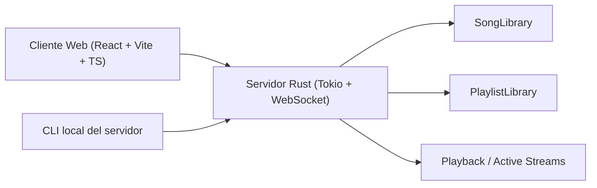
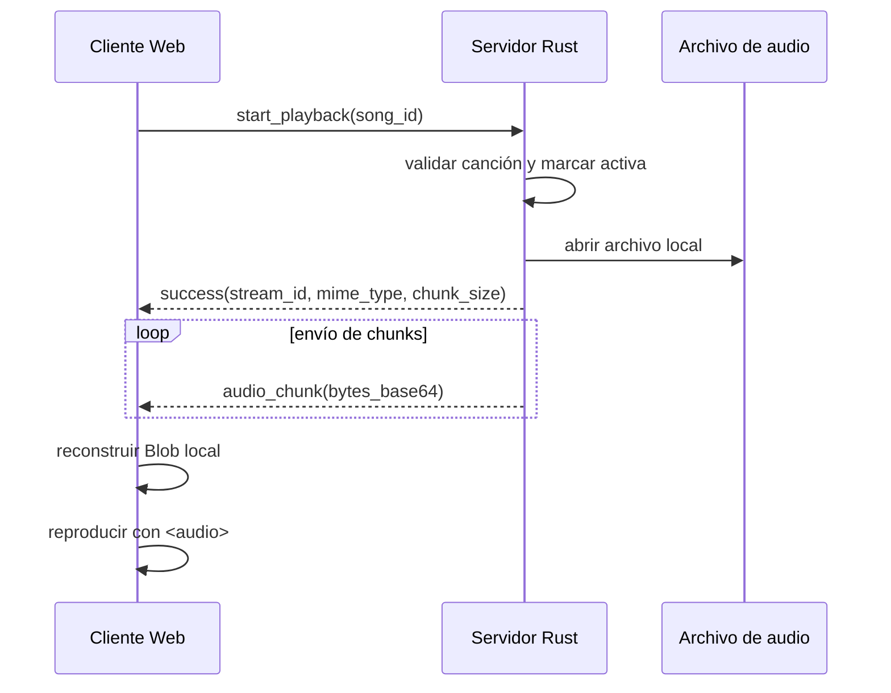

# Informe Final - SpotiCry

## 1. Descripción del problema

SpotiCry es un sistema cliente-servidor para administración y reproducción de canciones. El problema planteado en el enunciado consiste en desarrollar una solución donde:

- un servidor en Rust administre canciones localmente
- varios clientes puedan consultarlo de forma concurrente
- el cliente pueda buscar, organizar y reproducir canciones
- la administración de playlists se implemente con enfoque funcional en Rust

El reto principal no es solo mostrar canciones en pantalla, sino coordinar varias responsabilidades al mismo tiempo:

- manejo de archivos de audio
- estado compartido entre múltiples partes del servidor
- protocolo de comunicación claro entre cliente y servidor
- reproducción real de audio
- buffer local de la canción actual
- manejo de playlists con restricciones de programación funcional

## 2. Objetivos

### 2.1 Objetivo general

Diseñar e implementar un sistema cliente-servidor funcional para administración, búsqueda, organización y reproducción básica de canciones, utilizando Rust para el servidor y una aplicación web para el cliente.

### 2.2 Objetivos específicos

- Implementar un servidor concurrente en Rust capaz de atender múltiples solicitudes de clientes.
- Administrar localmente un catálogo de canciones a partir de archivos de audio.
- Definir un protocolo de comunicación estructurado entre cliente y servidor.
- Permitir búsqueda de canciones con múltiples criterios.
- Implementar reproducción básica de audio a través de envío de bytes desde el servidor.
- Permitir al cliente mantener buffer local de la canción actual para hacer seek.
- Implementar playlists en memoria del servidor con enfoque funcional.
- Construir una interfaz gráfica que use únicamente datos reales proporcionados por el servidor.

## 3. Alcance de la solución

La solución implementada cubre:

- administración local de canciones en el servidor
- consulta y búsqueda desde un cliente web
- reproducción básica por WebSocket
- buffer local de la canción actual
- creación y gestión de playlists
- administración de canciones y playlists desde CLI del servidor

No se incluyó:

- base de datos
- almacenamiento en la nube
- persistencia permanente de playlists
- streaming progresivo avanzado con `MediaSource`
- sincronización multiusuario compleja

Estas decisiones fueron intencionales para mantener el proyecto dentro de un alcance universitario manejable.

## 4. Requisitos funcionales y estado de cumplimiento

### 4.1 Requisitos del servidor

| Requisito | Estado | Observación |
|---|---|---|
| Listar canciones según criterios de búsqueda | Cumplido | Se implementó listado y búsqueda por `title`, `artist`, `album` y `genre`. |
| Al menos 3 criterios diferentes de búsqueda | Cumplido | Se usan técnicas distintas según criterio: `contains`, prefijo por palabra, prefijo global y coincidencia exacta. |
| Inicio de reproducción | Cumplido | Acción `start_playback` con envío de metadata y chunks de audio. |
| Finalización de reproducción | Cumplido | Acción `stop_playback` con limpieza de estado activo. |
| Agregar canciones desde archivos locales | Cumplido | CLI soporta registro individual y carga por carpeta de archivos `.mp3` y `.wav`. |
| Eliminar canciones si no están reproduciéndose | Cumplido | El servidor impide eliminar canciones activas. |
| Interfaz de texto propia del servidor | Cumplido | Existe CLI local con administración de canciones y playlists. |
| Administración de playlists | Cumplido | Crear, listar, agregar/remover canciones, filtrar, ordenar y resumir playlists. |
| Manejo funcional exclusivo para playlists | Cumplido razonablemente | Se usan `map`, `filter`, `fold`, closures y helpers puros para operaciones de playlist. |

### 4.2 Requisitos del cliente

| Requisito | Estado | Observación |
|---|---|---|
| Interfaz gráfica para listas de canciones | Cumplido | Cliente web en React + Vite + TypeScript. |
| Reproducir canciones | Cumplido | El cliente recibe audio desde el servidor y reproduce con `<audio>`. |
| Buscar canciones por al menos 3 criterios | Cumplido | La UI permite buscar por `title`, `artist`, `album` y `genre`. |
| Crear playlists | Cumplido | La vista de playlists permite crear playlists reales en servidor. |
| Agregar canciones a más de una playlist | Cumplido | Una canción puede pertenecer a varias playlists. |
| Buffer local de la canción actual | Cumplido | Solo la canción actual se reconstruye como `Blob` en el navegador. |
| Adelantar y retroceder cuantas veces se quiera en la canción actual | Cumplido | El seek ocurre sobre el buffer local del `<audio>` del navegador. |

## 5. Requisitos no funcionales y decisiones de diseño

| Requisito no funcional | Estado | Decisión tomada |
|---|---|---|
| Concurrencia en servidor | Cumplido | Uso de Tokio y manejo concurrente de clientes. |
| Ejecución en máquina real | Cumplido | Backend compilable y ejecutable con `cargo run`. |
| Sin base de datos | Cumplido | Toda la metadata y playlists viven en memoria. |
| Sin almacenamiento en la nube | Cumplido | Canciones y playlists se resuelven localmente. |
| Comunicación clara entre módulos | Cumplido | Protocolo JSON estructurado por `request_id`, `status`, `data`, `error`. |
| Claridad arquitectónica | Cumplido | Separación modular en backend y frontend. |
| Enfoque académico, no sobreingeniería | Cumplido | Se priorizó estabilidad y claridad sobre complejidad avanzada. |

## 6. Análisis técnico de la solución

### 6.1 Arquitectura general

El sistema se divide en dos módulos principales:

- **Servidor Rust**: administra canciones, playlists, reproducción y protocolo WebSocket.
- **Cliente web**: consume el servidor, presenta la UI y reproduce el audio recibido.

### 6.2 Dónde conviene insertar un diagrama general

**Este es un buen lugar para insertar un diagrama de arquitectura general del sistema.**

El diagrama debería mostrar:

- cliente web
- CLI del servidor
- servidor WebSocket
- módulos internos del backend
- estado compartido (`songs`, `playlists`, `active_streams`)

Un diagrama adecuado sería así:



### 6.3 Backend

La estructura actual del backend es:

```text
server-rust/src/
├── cli/
├── network/
├── playback/
├── playlists/
├── protocol/
├── songs/
└── state/
```

#### Responsabilidades principales

- `songs/`: modelo de canción, validación, metadata, catálogo y búsquedas
- `playlists/`: modelo, operaciones funcionales y resumen
- `playback/`: lectura de archivos, chunks y control de streams activos
- `protocol/`: requests, responses y errores estructurados
- `network/`: servidor WebSocket y routing de acciones
- `cli/`: interfaz local de administración
- `state/`: `AppState` compartido

### 6.4 Frontend

La estructura actual del frontend es:

```text
frontend/src/
├── app/
├── api/
├── components/
├── features/
├── shared/
├── types/
└── views/
```

#### Responsabilidades principales

- `api/`: cliente WebSocket y tipos del protocolo
- `features/songs`: consulta y búsqueda de canciones
- `features/playlists`: creación y gestión de playlists
- `features/playback`: reproducción y buffer local
- `views/`: Songs, Playlists, Playlist Detail y Now Playing

### 6.5 Catálogo de canciones

El catálogo se administra en memoria mediante:

```rust
Arc<Mutex<SongLibrary>>
```

Las canciones se registran desde archivos locales `.mp3` y `.wav`.

El CLI del servidor permite dos estrategias:

- carga individual con `add <ruta>`
- carga masiva por carpeta con `add-dir <carpeta>`

Cada canción conserva al menos:

- `id`
- `title`
- `artist`
- `album`
- `genre`
- `duration`
- `file_path`

El sistema valida:

- existencia del archivo
- tipo de archivo
- duplicados

La metadata se intenta leer desde el archivo de audio y, si no está disponible, se usa fallback controlado.

### 6.6 Búsqueda de canciones

La búsqueda implementada cumple con el requerimiento de múltiples criterios y además usa técnicas distintas para hacerla más defendible:

- `title`: coincidencia parcial con `contains`
- `artist`: coincidencia por prefijo en cualquiera de las palabras
- `album`: coincidencia por prefijo del nombre del álbum
- `genre`: coincidencia exacta normalizada

Esto evita que todos los criterios se resuelvan exactamente con el mismo patrón técnico.

### 6.7 Reproducción de canciones

El flujo de reproducción es:

1. el cliente solicita `start_playback`
2. el servidor valida la canción
3. el servidor la marca como activa
4. el archivo local se abre con Tokio
5. el audio se envía por chunks codificados en base64
6. el frontend reconstruye la canción actual en memoria
7. el navegador la reproduce con `<audio>`

### 6.8 Dónde conviene insertar un diagrama de secuencia

**Después de esta sección conviene insertar un diagrama de secuencia de reproducción.**

Ese diagrama debería mostrar:

- cliente
- servidor
- archivo local
- respuesta inicial
- envío de chunks
- reproducción en navegador

Ejemplo base:



### 6.9 Buffer local de la canción actual

El cliente mantiene en memoria **solo la canción actual**.

La estrategia usada es:

- recibir chunks del servidor
- reconstruir la canción como `Blob`
- usar `URL.createObjectURL(...)`
- reproducir con `<audio>`

Esto permite:

- adelantar
- retroceder
- repetir seek varias veces

sin volver a pedir la misma canción al servidor mientras siga siendo la canción activa local.

### 6.10 Playlists y enfoque funcional

Las playlists viven en el servidor y no en el cliente. Esta decisión se tomó porque:

- centraliza la fuente de verdad
- evita desincronización entre clientes
- deja la lógica de negocio en Rust

Las operaciones principales de playlist se diseñaron con enfoque funcional:

- agregar canción retorna una nueva playlist
- remover canción usa `filter`
- filtrado de canciones usa closures
- ordenamiento trabaja sobre copias temporales
- resumen usa `fold`

### 6.11 Dónde conviene insertar un diagrama de playlists

**Después de esta sección conviene insertar un diagrama simple del flujo de playlist.**

Ese diagrama debería mostrar:

- cliente solicitando crear playlist
- servidor creando o actualizando `PlaylistLibrary`
- cliente consultando o actualizando una playlist

Ejemplo:


### 6.12 Manejo de concurrencia y sincronización

El proyecto usa:

- `Arc<Mutex<SongLibrary>>`
- `Arc<Mutex<PlaylistLibrary>>`
- estado compartido para reproducción

Esto permite que:

- el CLI local y el WebSocket compartan el mismo estado
- múltiples clientes consulten el servidor
- se protejan secciones críticas como activación, borrado o actualización de playlists

#### Cómo sería el problema sin sincronización

Sin sincronización podrían ocurrir problemas como:

- dos clientes modificando el catálogo al mismo tiempo
- borrado de una canción mientras otra conexión la activa
- inconsistencias en playlists mientras se actualizan

Con la sincronización actual se evita ese tipo de conflictos dentro del alcance del proyecto.

## 7. Resultados obtenidos

Los principales resultados del proyecto fueron:

- implementación de un servidor concurrente funcional en Rust
- administración local de canciones con archivos reales
- protocolo WebSocket estructurado y extensible
- cliente web conectado a datos reales del servidor
- reproducción de audio real end-to-end
- buffer local de la canción actual en el navegador
- administración funcional de playlists en el servidor
- CLI del servidor para canciones y playlists

## 8. Análisis de resultados

### 8.1 Aspectos positivos

- La arquitectura modular facilitó mucho extender el proyecto sin tener que rehacerlo.
- La decisión de usar WebSocket con JSON permitió depurar fácilmente el protocolo.
- El uso de estado compartido en memoria fue suficiente para un proyecto académico.
- El buffer local del navegador resolvió de forma simple el requisito de seek.
- Separar la lógica funcional de playlists ayudó a justificar mejor el uso de `map`, `filter` y `fold`.

### 8.2 Limitaciones encontradas

- Las playlists no persisten al reiniciar el servidor.
- La reproducción no usa streaming progresivo avanzado.
- El sistema no está pensado para producción a gran escala.
- La sincronización actual es suficiente para el curso, pero no para una plataforma real con alta carga.

### 8.3 Hallazgos sobre sockets y paralelismo

- WebSocket resultó más cómodo que una solución TCP manual para el tipo de cliente web implementado.
- La existencia de `request_id` hizo más clara la correlación entre request y response.
- El manejo del estado activo de reproducción fue uno de los puntos más delicados, porque había que mantener consistencia entre reproducción, eliminación y UI.

## 9. Mejoras recomendadas a futuro

Si el sistema tuviera que evolucionar hacia una versión más robusta, convendría:

- persistir canciones y playlists en base de datos
- almacenar playlists de forma duradera
- implementar autenticación por usuario
- permitir múltiples canciones activas por usuario o sesión
- usar un modelo de reproducción más avanzado con `MediaSource`
- mejorar la observabilidad con logs y métricas
- separar más claramente capa de dominio, capa de aplicación y transporte

## 10. Conclusiones

SpotiCry logró resolver el problema propuesto mediante una arquitectura cliente-servidor clara, funcional y académicamente defendible.

El servidor en Rust cumple con la administración local de canciones, el manejo de playlists, la reproducción básica y la atención concurrente de solicitudes. Por su parte, el cliente web permite interactuar con el sistema de forma visual, buscar canciones, crear playlists y reproducir la canción actual con buffer local.

Aunque la solución no pretende ser una plataforma de producción, sí demuestra correctamente los conceptos solicitados por el enunciado:

- concurrencia
- comunicación entre cliente y servidor
- manejo de archivos
- buffer local de reproducción
- enfoque funcional para playlists

En resumen, el proyecto cumple el propósito académico planteado y deja una base suficientemente buena para seguir creciendo.

## 11. Recomendaciones para la entrega final

- Incluir capturas de pantalla del cliente web funcionando.
- Incluir una prueba corta del CLI del servidor.
- Insertar al menos tres diagramas:
  1. arquitectura general
  2. secuencia de reproducción
  3. flujo de playlists
- Usar este documento como base principal y los demás archivos de `docs/` como respaldo técnico.

## 12. Anexos sugeridos

Como anexos del informe se pueden citar o reutilizar:

- `docs/song-catalog-and-cli.md`
- `docs/websocket-protocol.md`
- `docs/playback-flow-and-state.md`
- `docs/playlist-storage-and-functional-style.md`
- `docs/frontend-client-behavior.md`
- `docs/server-cli-search.md`
- `docs/server-cli-playlists.md`
- `docs/web-now-playing-buffer.md`
- `docs/web-playback-queue.md`

Estos documentos complementan el detalle técnico del sistema y ayudan a justificar decisiones de diseño y alcance.

### 12.1 Anexo A - Comandos para probar la consola del servidor

Este anexo puede incluirse como evidencia práctica de que el servidor cuenta con una interfaz de texto propia para administración de canciones y playlists.

#### Comandos básicos del CLI

```text
help
list
search
add ./src/songs/christmas.mp3
add-dir ./src/songs
delete song-001
active
active song-001
exit
```

#### Qué hace cada comando

- `help`: muestra todos los comandos disponibles
- `list`: lista las canciones cargadas en el catálogo
- `search`: inicia la búsqueda interactiva por criterio
- `add <ruta>`: agrega una canción desde un archivo local
- `add-dir <carpeta>`: intenta agregar todas las canciones soportadas encontradas en una carpeta local
- `delete <song-id>`: elimina una canción del catálogo si no está en reproducción
- `active`: muestra la canción activa actual
- `active <song-id>`: marca una canción como activa
- `exit`: cierra el CLI local del servidor

#### Ejemplos de búsqueda

```text
search
Search criterion (title/artist/album/genre): title
Search value: christmas
```

```text
search
Search criterion (title/artist/album/genre): artist
Search value: adele
```

```text
search
Search criterion (title/artist/album/genre): genre
Search value: pop
```

#### Comandos de playlists desde la consola

```text
playlist list
playlist create My Favorites
playlist songs playlist-001
playlist add-song playlist-001 song-001
playlist remove-song playlist-001 song-001
playlist filter playlist-001 title christmas
playlist filter playlist-001 artist adele
playlist filter playlist-001 genre pop
playlist sort playlist-001 title asc
playlist sort playlist-001 artist desc
playlist sort playlist-001 duration asc
playlist summary playlist-001
```

#### Flujo sugerido de prueba manual

Un flujo corto y fácil de mostrar durante la demostración sería:

```text
add ./src/songs/christmas.mp3
add ./src/songs/navidad.mp3
add-dir ./src/songs
list
search
playlist create Demo Playlist
playlist list
playlist add-song playlist-001 song-001
playlist songs playlist-001
playlist summary playlist-001
active song-001
delete song-001
```

Este flujo permite evidenciar:

- carga real de canciones
- carga individual y carga masiva por carpeta
- consulta del catálogo
- búsqueda por criterio
- creación de playlist
- agregado de canciones a playlist
- resumen de playlist
- protección de borrado cuando una canción está activa

### 12.2 Anexo B - Qué conviene poner en anexos

Además de los comandos del CLI, los anexos del informe podrían incluir:

- capturas del frontend funcionando
- ejemplos de requests y responses WebSocket
- capturas de la consola del servidor
- resultados de pruebas manuales
- diagramas completos si no se quieren dejar dentro del cuerpo principal

La ventaja de usar anexos es que el informe principal se mantiene más limpio y más fácil de leer, mientras que la evidencia práctica queda disponible para revisión.
